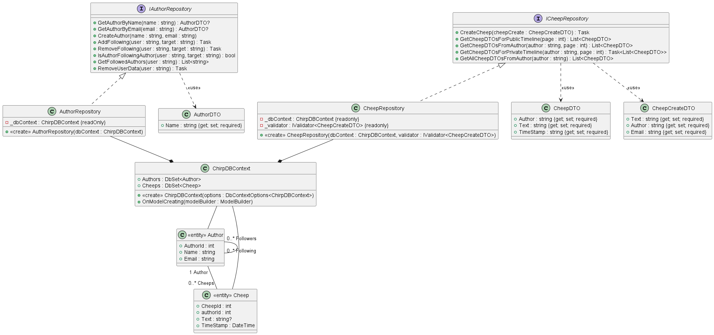
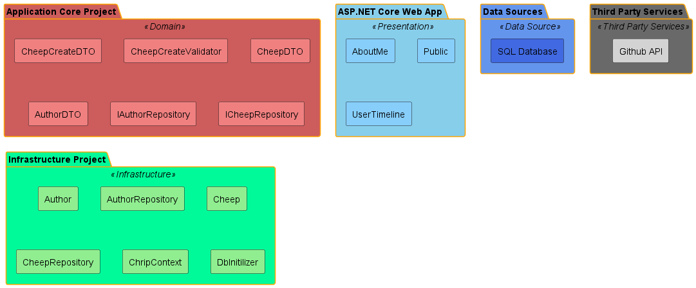
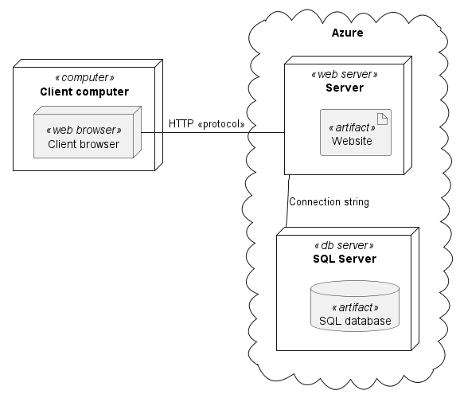
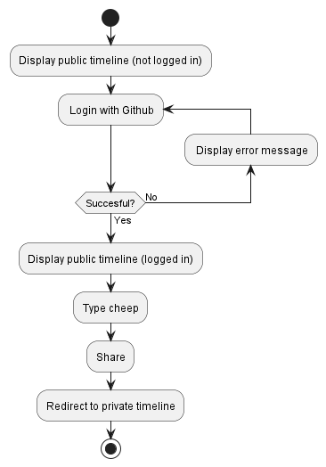
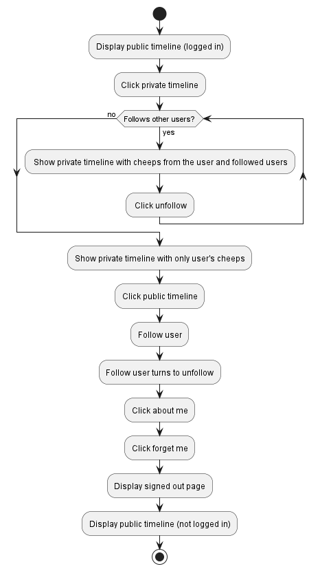
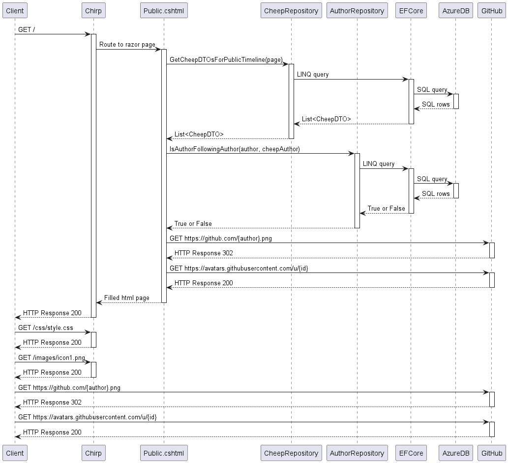
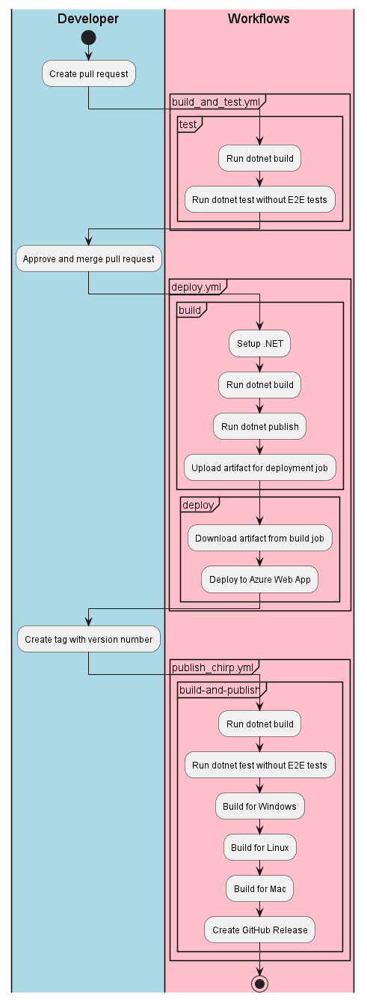
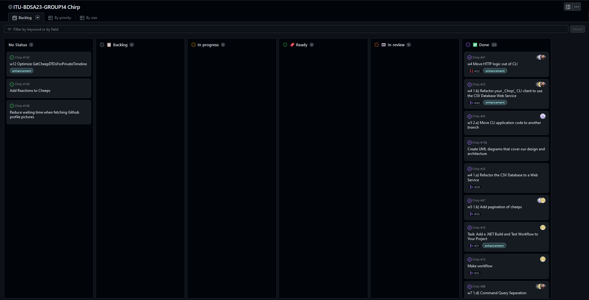

# Design and Architecture of _Chirp!_

## Domain model

Our domain model has the interfaces 'IAuthorRepository' and 'ICheepRepository'.
They define the logic needed for the Chirp platform to operate.
This includes functionality relevant to users, like following another user, but also functionality relevant to the operation of the backend, like locating an author by their email.

The 'AuthorRepository' and 'CheepRepository' implement the logic of their respective interfaces.
Both of them take the 'ChirpDBContext' as a field, in order to set up and interact with the database.

The 'ChirpDBContext' contains the two DbSet 'DbSet<Author>' and 'DbSet<Cheep>'.
The DbSets are defined by their entities, 'Author' and 'Cheep', which represent the users of the Chirp website and their Cheeps.

The interfaces define methods that return 'DTOs'.
They are 'AuthorDTO', 'CheepDTO' and 'CheepCreateDTO'.

The 'AuthorDTO' and 'CheepDTOs' exclusively contain the data that is accessible by users of the Chirp website.  
This reduces HTTP traffic and ensures that we follow the principle of least privilege, which means that we don't expose sensitive infrastructure like database IDs.

'CheepCreateDTO' separates the input data needed to create a 'CheepDTO' from the domain model.
This increases security as we prevent external clients from interacting with the domain model we use internally.

{ width=120% margin=auto }

## Architecture — In the small

{ width=400px }

### Application Core Project - Domain

 The "Application Core Project" includes entities like 'CheepCreateDTO', 'CheepCreateValidator', 'CheepDTO', and interfaces like 'IAuthorRepository' and 'ICheepRepository'. This layer does not depend on any other layer.

### Infrastructre Project - Infrastructure

Surrounding the core is the infrastructure layer, which also interacts with the SQL database. The "Infrastructure Project" contains implementations such as 'AuthorRepository' and 'CheepRepository', and infrastructure concerns like 'ChirpContext' and 'DbInitializer'. This layer depends on the Application Core to implement the interfaces defined in there.

### ASP.NET Core Web App - Presentation

On the outside of our Onion Architecture is the presentation layer. The "ASP.NET Core Web App" contains '.cshtml' files such as 'AboutMe' and 'Public'. This layer depends on both the Application Core and Infrastructure Project to get data and execute operations.

### Data Sources & Third Party Services - External Dependencies

The "Data Sources" and "Third Party Services" are respectively used to represent databases and other services that the application interacts with. The "SQL Database" is used to keep and manage data while "GitHub API" is used both as an identity provider to authenticate users and to fetch profile pictures of users.

## Architecture of deployed application

This diagram shows an example of a client communicating with the deployed application. The website artifact itself is created in a GitHub workflow.


{ width=350px }

\newpage

## User activities

The first diagram below illustrates the first page that is presented to a non-authorized user, the login process and some features that the user can access after loggin in.

The second diagram below illustrates the follow and unfollow feature accessible by authenticated users as well as user's ability to be forgotten and see what information is saved about them.

{ height=300px }

{ height=500px }

\newpage

## Sequence of functionality/calls through _Chirp!_

{ width=400px }

The sequence diagram shows what happens when a client tries to access the Chirp webpage.

The 'IsAuthorFollowingAuthor(author, cheepAuthor)' query as well as the 'GET https://github.com/{author}.png' query are run for every cheep on the page but are only shown once on the diagram for brevity.

\newpage

# Process

## Build, test, release, and deployment

In the diagram shown above, we show the various GitHub workflows we make use of. The activities in the workflow swimlane are run automatically when the developer performs the actions in the developer swimlane.

When a developer has finished working on an issue they create a pull request, which is where the diagram shown below starts. The workflows are setup to maximise productivity and minimise bugs. For example, pull requests cannot be merged without the test workflow running and all the tests passing. The test workflow itself is set to not include E2E tests by default, but we can manually run "dotnet test" to quickly ensure that everything works.

{ height=400px }

\newpage

## Team work

### Project board

Below is a screenshot of our project-board. 
We have three open issues.

Issue #142 is an optimization of our code as the way we currently fetch cheeps for users' private timelines could be done more efficiently.

Issue #128 is the next wildstyle feature we would add, if we were to continue the project work. 

Issue #168 is an optimization we discovered during the project demo.
The issue describes how we could reduce loading time of pages by removing an unnecessary checker when fetching Github profile pictures.

{ width=500px }

### Activity flow

At the beginning of every week, we created one issue for each task. Each issue followed the same format of:

- Overview: A brief description of the task.
- User Story: A human centric context for the task.
- Acceptance criteria: A list of subtasks required for completing the task.
- Full task description: For the mandatory weekly tasks, we included the full task description from the course Github page. (This was omitted for wildstyle features)

When starting a task, we used the Github feature of creating a branch directly connected to each issue, and used the automatic naming convention for these branches.
Once a branch was created, and specific people were assigned to the issue, the task was moved from "Backlog" to "In progress" on the project board.
Once a task was finished, a pull request was created to the main branch.
A pull request required at least two reviews and successful test actions to be merged. Team members who did not contribute to the specific task were prioritized as reviewers. If all members worked on the task, this requirement was bypassed.
Once a pull request was merged, the branch was deleted and the task was automatically moved to "Done" on the project board.
If any new issues came up during the week, either in form of bug-fixes or new features, these were created immediately.

## How to make _Chirp!_ work locally

Prerequisites: git, .NET 7, and Docker Desktop.\
Clone the repository to a desired directory with the following command:

```
git clone https://github.com/ITU-BDSA23-GROUP14/Chirp.git
```

Then run the next command to start up a docker container:

```
docker run -e "ACCEPT_EULA=Y" -e 
"MSSQL_SA_PASSWORD=33eca922-74a0-11ee-9e21-00155d9a126b" 
-p 1433:1433 --name sql-server -d mcr.microsoft.com/mssql/server:2022-latest
```
Once the docker container has been initialized, from the Chirp/src/Chirp.Web directory run the following commands to set user-secrets:

```
dotnet user-secrets set "ConnectionStrings:Chirp" "Data Source=localhost,1433;
Initial Catalog=Chirp;User=sa;Password=33eca922-74a0-11ee-9e21-00155d9a126b;
TrustServerCertificate=True"
```

```
dotnet user-secrets set "AzureAdB2C:ClientId" "4f6b92aa-49e6-4e9b-b2ba-5a00ab7402f7"
```

Lastly, to start the project run the following command from the Chirp/src/Chirp.Web directory:

```
dotnet run
```

_Chirp!_ is then running locally and is accessible through http://localhost:5273/ in your chosen browser.

## How to run test suite locally

Prerequisites: .NET 7 and Playwright installed.\
Navigate to the outermost directory named "Chirp" and run the 'dotnet test' command in the terminal.

We perform End2End tests, Integration tests, and Unit tests.

The End2End and integration tests test the outer layer of the architecture.
End2End tests focus on the UI and the user workflow.
The integration tests focus on the connection between the server and the client, testing HTTP endpoints and pagination.
The unit tests focus on the domain and application layers, testing our enterprise business rules and application business rules.

# Ethics

## License

We chose to use the MIT License for our application.

## LLMs, ChatGPT, CoPilot, and others

We made use of Chat-GPT.
We intentionally refrained from using it to write code.
We used it to establish a basic understanding of concepts, usually before reading official .NET documentation.  
When testing, we used it to interpret stack traces, which allowed us to locate bugs faster, and then squash them ourselves.

Both of these use cases allowed us to focus on the productive parts of the learning process, while avoiding mindless copy-pasting.
